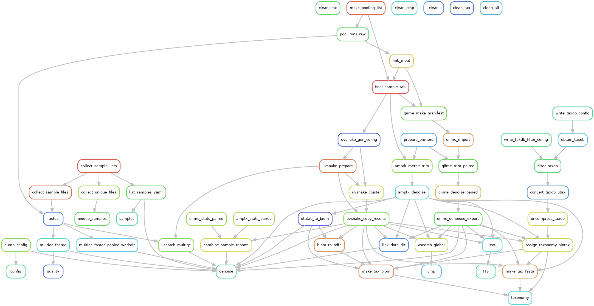

# Target rules ("commands") and output files

## Rule graph

## List of rules

### Initial checks

- **config**: Allows checking the pipeline configuration, creates the files `results/samples.yaml` and `<pipeline>/config.yaml`
- **samples**: Creates links (symlinks) of the input files to the `input` directory. The sample files in the resulting `input/unique_samples` directory can e.g. be used for upload to public SRA databases. Furthermore, the samples lists `results/samples.yaml` and `results/samples.tsv` are created, providing the necessary sample metadata (see *config* command).
- **quality**: Runs [FastQC](https://www.bioinformatics.babraham.ac.uk/projects/fastqc) and [MultiQC](https://multiqc.info) (output in `results/_validation`). This can be done in a first step before deciding on the quality filtering/trimming options in `config/config.yaml`.

### Denoising (clustering)

- **denoise**: Does the denoising (clustering) for all pipelines, as specified in `config/config.yaml`. The results are normally found in `results/<pipeline>/data`, unless the input files contain both paired and single-end (different "sequencing strategies"), or multiple primer combinations are specified. In this case, the output path is `results/<pipeline>/pipeline_.../<primers>/<strategy>`.

### Analysis of denoised sequences

- **taxonomy**: Assigns taxonomic labels to denoised/clustered sequences. Several methods can be specified in `config/config.yaml`. The output files are in the `taxonomy` subdirectory of the denoising results directory.
- **cmp**: Runs sequence comparisons with files listed in `config/config.yaml` (`compare` key). The comparisons are done with VSEARCH, using the denoised FASTA as query and the given sequence files as database. The result is a tab-delimited mapping file stored in the `cmp` subdirectory of the denoising results directory (along with a few other files).
- **ITS**: Runs [ITSx](https://microbiology.se/software/itsx) to recognize rDNA domains (or parts of them) and locate the internal transcribed spacer (ITS) regions. The information from the positions file (`ITSx/out.positions.txt`) is used to distinguish "true" ITS sequences from possible unspecific amplification (see also [example analysis](test/R_example/example.md#read-data)).

### Cleanup

- **clean**: Removes the working directories `input/grouped` and `processing`. The `results` and `logs` directories are retained.
- **clean_all**: Cleans up everything (including the pipeline output), except for taxonomic reference databases. This should only be used to **completely remove** all output from a target directory.
- **clean_taxdb**: Removes the `refdb` directory
- **clean_tax**, **clean_cmp**, **clean_itsx**: Removes the `taxonomy`, `cmp` or `ITSx` directories in all results directories.

## List of output directories / files

- **input**: Contains all input sequence files (FASTQ, generated by *collect_input* and many other commands)
  - **input/grouped**: hierarchical grouping of the files, which is then used as input for the pipelines.
  - **input/unique_samples**: lists all input sample files in one directory. Samples with identical names (but from different directories) are de-duplicated by adding a numbered suffix.
- **processing**: Contains all temporary data used by the denoising pipelines. In some cases, this can result in gigabytes of data, so be careful to monitor its size. Once everything is finished (deposited in the *results* dir), it can be safely removed with the *clean* command. Downstream target rules such as *txonomy*, *cmp* and *ITS* don't need this directory to be present.
- **results**: Results directory
  - **sample lists / config files**: Useful to check the input configuration and to obtain sequence metadata (generated by *config*, *collect_input* and *denoise* commands)
    - `samples.yaml` lists the sample names and the corresponding input files ([example](test/results/samples.yaml))
    - The tab-separated `results/samples.tsv` file also lists all unique samples and their corresponding read files in tabular format ([example](test/results/samples.tsv)). This table is especially useful when submitting sample metadata to public SRA archives. Identical sample files from different directories are assumed to be long to a different sequencing run and thus a numbered suffix is added to make the names unique.
    - The files `<pipeline>/config.yaml` contain the final configuration of each pipeline used internally (slightly modified, structure may change with later versions) ([example](test/results/unoise/config.yaml)). This is especially useful to check, whether additional settings specified in the `pipelines` definition in `config/config.yaml` correctly override the default settings.
  - **results/_validation**: Contains QC of every input file and a MultiQC summary (`results/_validation/multiqc/multiqc_report.html`). Generated by *quality* and *denoise* command
  - **denoising results directories** (*denoise* command): `results/<pipeline>/data` in simple cases or `results/<pipeline>/pipeline_.../<primers>/<strategy>` in the case of multiple primer combinations and sequencing strategies. Contents:
    - `denoised.fasta`: Denoised / clustered sequences
    - `denoised_otutab.txt.gz` / `denoised.biom`: OTU table in flat text format (gzip-compressed) or in BIOM format
    - **taxonomy** (*taxonomy* command): The directory containing the taxonomic assignments. The file names are constructed as follows `<ref. database>-<assignment method>-<assignment name>.txt.gz`. In addition, a GZIP-compressed BIOM file is created.
      - *fasta*: subdirectory containing FASTA files annotated with taxonomy
    - **cmp** (*cmp* command): Results of sequence comparisons, which are tab-delimited mapping files with three columns: *query* (ASV/OTU), *target* (from custom sequence database), *percent identity* (edit distance excluding terminal gaps in the alignment, see also `-iddef` USEARCH/VSEARCH option). FASTA files of both the non-matched query and database sequences are also created, as well as a *BAM file*, which allows viewing/extracting the alignments of query and target sequences.
  - **sample report** (*denoise* command): A sample report with read numbers retained in each step is placed in `results/<pipeline>/pipeline_.../_validation`, along with another MultiQC report including Cutadapt statistics (currently only UNOISE pipeline).
- **logs**: Contains all logfiles by the different commands. Usually it is not necessary to consult them unless there is an error. *Logs* is left in place by the *clean* command.