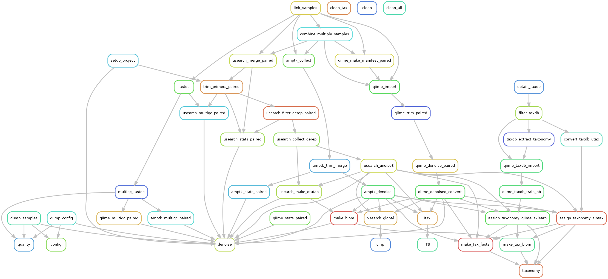

# Target rules ("commands") and output files

## Rule graph

## List of rules

### Initial checks

- **config**: Allows checking the pipeline configuration, creates the files `results/samples.yaml` and `<pipeline>/config.yaml`
- **samples**: Creates links (symlinks) of the input files to the `input` directory. The sample files in the resulting `input/unique_samples` directory can e.g. be used for upload to public SRA databases. Furthermore, the samples lists `results/samples.yaml` and `results/samples.tsv` are created, providing the necessary sample metadata (see *config* command).
- **quality**: Runs [FastQC](https://www.bioinformatics.babraham.ac.uk/projects/fastqc) and [MultiQC](https://multiqc.info) (output in `results/_validation`). This can be done in a first step before deciding on the quality filtering/trimming options in `config/config.yaml`.

### Denoising (clustering)

- **denoise**: Does the denoising (clustering) for all pipelines, as specified in `config/config.yaml`. The results are normally found in `results/<pipeline>/data`, unless the input files contain both paired and single-end (different "sequencing strategies"), or multiple primer combinations are specified. In this case, the output path is `results/<pipeline>/pipeline_.../<primers>/<strategy>`.

### Analysis of denoised sequences

- **taxonomy**: Assigns taxonomic labels to denoised/clustered sequences. Several methods can be specified in `config/config.yaml`. The output files are in the `taxonomy` subdirectory of the denoising results directory.
- **cmp**: Runs sequence comparisons with files listed in `config/config.yaml` (`compare` key). The comparisons are done with VSEARCH, using the denoised FASTA as query and the given sequence files as database. The result is a tab-delimited mapping file stored in the `cmp` subdirectory of the denoising results directory (along with a few other files).
- **ITS**: Runs [ITSx](https://microbiology.se/software/itsx) to recognize rDNA domains (or parts of them) and locate the internal transcribed spacer (ITS) regions. The information from the positions file (`ITSx/out.positions.txt`) is used to distinguish "true" ITS sequences from possible unspecific amplification (see also [example analysis](test/R_example/example.md#read-data)).

### Cleanup

- **clean**: Removes the working directories `input/grouped` and `processing`. The `results` and `logs` directories are retained.
- **clean_taxdb**: Removes the taxonomic reference databases (`refdb` directory)
- **clean_tax**, **clean_cmp**, **clean_itsx**: Removes the `taxonomy`, `cmp` or `ITSx` directories in all results directories.
- **clean_all**: Cleans up everything (including the pipeline output), except for taxonomic reference databases. This should only be used to **completely remove** all output from a target directory.
