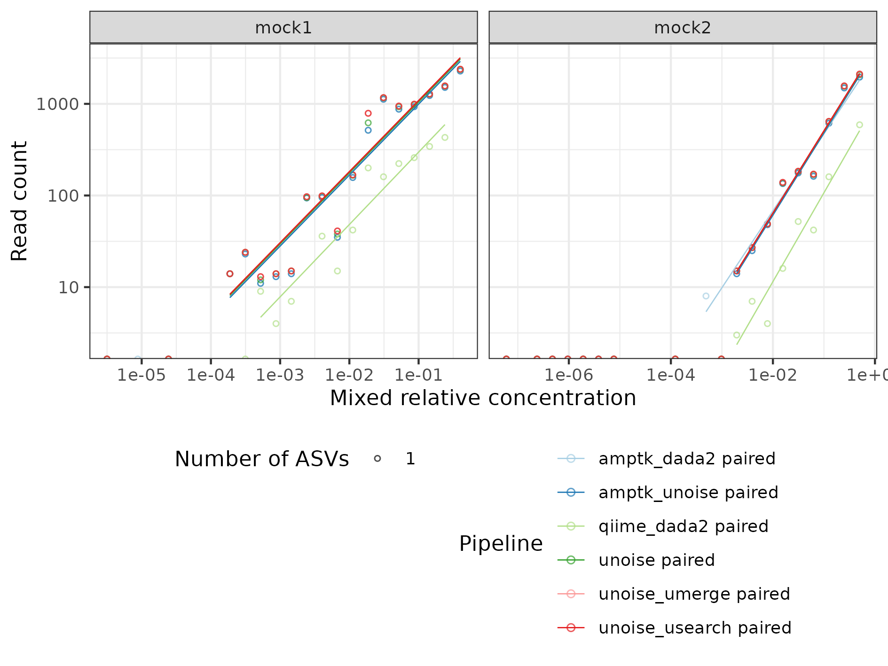

# Test data

The directory `test/gz` contains example files from an Illumina MiSeq run of two uneven (staggered) mock communities (Schlegel et al. 2018). A subset of 5000 reads is stored in the files. Another 5000 reads from the first uneven community (mock1) are in separate files in `mock1_more` directory to showcase the automatic merging of files with the same name. Due to the reduced sequencing depth, only the more abundant species in the community are found. Still, this dataset is useful for validating the pipelines and their parameter combinations.

## How to analyze

These commands run all the clustering pipelines (on a local computer) and compare the results.

```sh
conda activate snakemake
# run the denoising and ITSx with 6 cores
snakemake -c12 --use-conda --conda-prefix ~/conda -d test denoise ITS
# running sequence comparisons and taxonomy assignments only on one core
# to make sure that the order of ASVs does not change between runs
# TODO: couldn't yet figure out why adding '--rerun-incomplete --rerun-triggers mtime' is necessary
snakemake -c1 --use-conda --conda-prefix ~/conda -d test cmp taxonomy --rerun-incomplete --rerun-triggers mtime
# (optional) remove working directories (but not logs)
snakemake -c1 -d test clean
# run a general comparison script (useful for any pipeline comparison)
# (creates Excel file in test/cmp)
scripts/compare_results.sh test
# compare obtained ASVs with mixed gDNA concentrations (see test/mock_cmp/...)
(cd test && scripts/compare_mock.R)
## render the example Rmd (requires pandoc in PATH or RSTUDIO_PANDOC set, here for Ubuntu)
# If this doesn't work, you can still directly run the document in RStudio
RSTUDIO_PANDOC=/usr/lib/rstudio/resources/app/bin/quarto/bin/tools Rscript -e "rmarkdown::render('test/R_example/example.Rmd', 'github_document')"
# the following command would remove everything (including the results/ directory)
# snakemake -c1 -d test clean_all
```

The results of the comparison are found in `test/mock_cmp`. The mock community is fairly well represented by the UNOISE, Amptk/UNOISE and Amptk/Dada2 pipelines, while QIIME2 looses many reads due to quality filtering. Using this pipeline with variable-length ITS reads seems difficult.




## Validation using example workflows

In order to further carefully validate this pipeline, the test data was further analyzed using example scripts from the online documentation of the different tools, currently:

* [USEARCH pipeline](https://www.drive5.com/usearch/manual/ex_miseq_its.html) for MiSeq 2x300 fungal ITS
* [VSEARCH "alternative" pipeline](https://github.com/torognes/vsearch/wiki/Alternative-VSEARCH-pipeline/c4859786f05bba35d8c306de4a3d64fea40d9dbf) slightly modified to use UNOISE3 following the [this description](https://github.com/torognes/vsearch/pull/283). The pipeline follows the USEARCH strategy for OTU table construction, but using quality filtered instead of raw/unfiltered reads (as [recommended by USEARCH](https://www.drive5.com/usearch/manual/cmd_otutab.html)). Our pipeline currently follows the USEARCH approach with a 97% identity threshold. In the future, this should be configurable.

The following script runs the "simple" workflows and compares the results with the outcomes of our test pipeline:

```sh
# if running for the first time, do this first:
# conda env create -f scripts/simple/uvsearch_env.yaml
scripts/simple/compare.sh
```

## Reference

Schlegel, M., Queloz, V., and Sieber, T. N. (2018). The endophytic mycobiome of European ash and sycamore maple leaves – geographic patterns, host specificity and influence of ash dieback. *Frontiers in Microbiology* 9. doi: 10.3389/fmicb.2018.02345.
