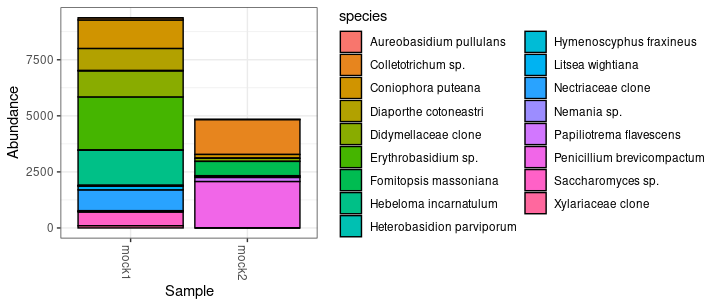

# Mock community analysis

``` r
library(phyloseq)
library(dplyr)
library(tibble)
library(ggplot2)
theme_set(theme_bw())

source(file.path("..", "..", "R", "read_amplicon.R"))
```

## Read data

First, we read all the data by simply specifying the results directory
path:

``` r
res_base <- file.path("..", "results")
# UNOIS3 pipeline
res_unoise <- read_pipeline_results(file.path(res_base, "unoise", "data"))
```

The result of `read_pipeline_results` is a list with different
components:

-   `otutab`: Count matrix with ASVs/OTUs in rows and samples in
    columns.
-   `taxonomy`: List of data frames, one per taxonomic assignment method
    (here, only one was used: unite-sintax_70) with OTU, taxonomic ranks
    and a `def_rank` column specifying the rank, at which the names are
    defined. The taxonomic table should never have any `NA` values.
    Unknown names were auto-filled based on the known names,
    e.g. `Ascomycota_ord_unknown`. At the species level, taxa re named
    `Saccharomyces sp.` (if genus known) or `Ascomycota clone` (genus
    unknown). These name patterns can be configured in
    `read_pipeline_results` (`unknown_fmt` and `unknown_species_fmt`,
    see documentation of `replace_missing_taxa`). Example with shortened
    names:

| OTU   | kingdom | phylum | class  | order  | family | genus            | species             | def_rank |
|:------|:--------|:-------|:-------|:-------|:-------|:-----------------|:--------------------|:---------|
| Zotu1 | Fungi   | Basidi | Cystob | Erythr | Erythr | Erythrobasidium  | Erythrobasidium sp. | genus    |
| Zotu2 | Fungi   | Basidi | Agaric | Agaric | Agaric | Agaricales_gen\_ | Agaricales clone    | order    |
| Zotu3 | Fungi   | Ascomy | Saccha | Saccha | Saccha | Saccharomyces    | Saccharomyces sp.   | genus    |
| Zotu4 | Fungi   | Ascomy | Sordar | Diapor | Diapor | Diaporthe        | Diaporthe sp.       | genus    |
| Zotu5 | Fungi   | Basidi | Agaric | Boleta | Coniop | Coniophora       | Coniophora puteana  | species  |
| Zotu6 | Fungi   | Ascomy | Dothid | Pleosp | Didyme | Didymellaceae_g  | Didymellaceae clone | family   |

-   `refseq`: OTU/ASV sequences as `Biostrings::DNAStringSet` object.
-   `tree`: tree object (not present in this case since the ITS region
    is too variable for creating a phylogenetic tree)
-   `cmp`: List of sequence comparisons with OTUS/ASVs. In this case,
    the ITS2 sequences of the mixed species in the mock communities were
    compared. The first few rows:

| query | target            | ident |
|:------|:------------------|------:|
| Zotu1 | E_hasegawianum    |   100 |
| Zotu2 | H_crustiliniforme |   100 |
| Zotu3 | S_cerevisiae      |   100 |
| Zotu4 | D_eres            |   100 |
| Zotu5 | C_puteana         |   100 |
| Zotu6 | Boeremia_sp_2     |   100 |

-   `itsx_results`: Finally, the rDNA domains were searched using ITSx,
    since these are fungal ITS sequences. The `ITSx_cat` contains
    (shortened) messages from ITSx. *partial_5.8S* means that not the
    whole 5.8S region was found, which is not surprising since the
    forward primer is located on the 5.8S region. The first few rows:

| OTU   | SSU | ITS1 | ITS2    | LSU     | ITSx_cat     |
|:------|:----|:-----|:--------|:--------|:-------------|
| Zotu1 | NA  | NA   | 106-328 | 329-368 | partial_5.8S |
| Zotu2 | NA  | NA   | 106-320 | 321-360 | partial_5.8S |
| Zotu3 | NA  | NA   | 106-338 | 339-378 | partial_5.8S |
| Zotu4 | NA  | NA   | 106-265 | 266-305 | partial_5.8S |
| Zotu5 | NA  | NA   | 107-367 | 368-407 | partial_5.8S |
| Zotu6 | NA  | NA   | 106-259 | 260-299 | partial_5.8S |

## Mixed vs. amplified frequencies

As an example, we compare the relative mixed amounts (genomic DNA) of
the different species with their read counts in the `mock1` community:

``` r
# we analyse the results of the UNOISE3 pipeline
res <- res_unoise

counts <- res$otutab %>%
  as.data.frame() %>%
  rownames_to_column("OTU")

mock_data <- read.delim(file.path("..", "mock", "mock_data.txt")) %>%
  # use the sequence comparison the match obtain the ASV names for each species
  left_join(res$cmp$mock, c("name" = "target")) %>%
  # then add the ASV counts
  left_join(counts, c("query" = "OTU")) %>%
  # then sum up the ASV counts per species
  group_by(name, rel_abund_m1) %>%
  summarise(
    n_reads = sum(mock1),
    n_reads = ifelse(is.na(n_reads), 0, n_reads),
    ASVs = paste(unique(na.omit(query)), collapse = ","),
    n_asvs = n(),
    .groups = "drop"
  ) %>%
  arrange(-rel_abund_m1)

head(mock_data)
```

| name              | rel_abund_m1 | n_reads | ASVs                | n_asvs |
|:------------------|-------------:|--------:|:--------------------|-------:|
| E_hasegawianum    |       0.4000 |    2372 | Zotu1               |      1 |
| H_crustiliniforme |       0.2400 |    1560 | Zotu2,Zotu20        |      2 |
| C_puteana         |       0.1440 |    1268 | Zotu5,Zotu10,Zotu15 |      3 |
| D_eres            |       0.0864 |     988 | Zotu4               |      1 |
| F_tritinctum      |       0.0518 |     942 | Zotu18              |      1 |
| Boeremia_sp_2     |       0.0311 |    1162 | Zotu6               |      1 |

``` r
ggplot(mock_data, aes(rel_abund_m1, n_reads)) +
  geom_point(aes(size = as.factor(n_asvs)), pch = 21, alpha = 0.7) +
  geom_smooth(method = "lm", formula = "y~x", se = F, size = 0.3) +
  scale_size_discrete(range = c(1, 4)) +
  scale_x_log10() +
  scale_y_log10() +
  labs(
    x = "Mixed relative concentration",
    y = "Read count",
    size = "Number of ASVs"
  ) +
  theme_bw() +
  theme(strip.text.y = element_text(angle = 0))
```

<!-- -->

## Make phyloseq object

The `make_phyloseq` function in the *read_input.R* script can directly
create a phyloseq object. The only additional thing we *must* supply
here is a metadata table (data frame) with ‘sample’ column or the row
names set to samples.

``` r
# minimal metadata table
meta <- data.frame(sample = c("mock1", "mock2"))
# create the phyloseq object
physeq <- make_phyloseq(res_unoise, meta = meta)
```

    ## Warning in make_phyloseq(res_unoise, meta = meta): taxonomy supplied as list to make_phyloseq, using first item (unite-sintax_70)

``` r
physeq
```

    ## phyloseq-class experiment-level object
    ## otu_table()   OTU Table:         [ 21 taxa and 2 samples ]
    ## sample_data() Sample Data:       [ 2 samples by 1 sample variables ]
    ## tax_table()   Taxonomy Table:    [ 21 taxa by 9 taxonomic ranks ]
    ## refseq()      DNAStringSet:      [ 21 reference sequences ]

Since there can be several taxonomic assignments, `make_phyloseq` just
chooses the first one. To choose a specific one, supply the taxonomy
table using the `taxonomy` argument. In this example, we modify the
taxonomy by removing the `def_rank` column first.

``` r
tax <- res_unoise$taxonomy$`unite-sintax_70` %>%
  select(-def_rank)
physeq <- make_phyloseq(res_unoise, meta = meta, taxonomy = tax)
```

``` r
plot_bar(physeq, fill = "species") +
  guides(fill = guide_legend(ncol = 2))
```

<!-- -->
